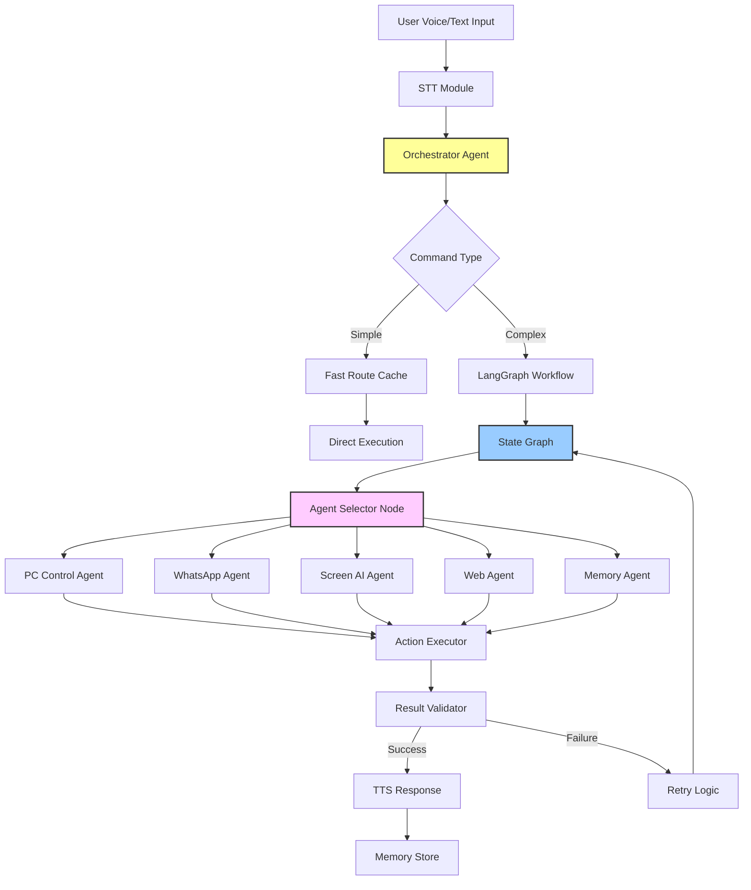
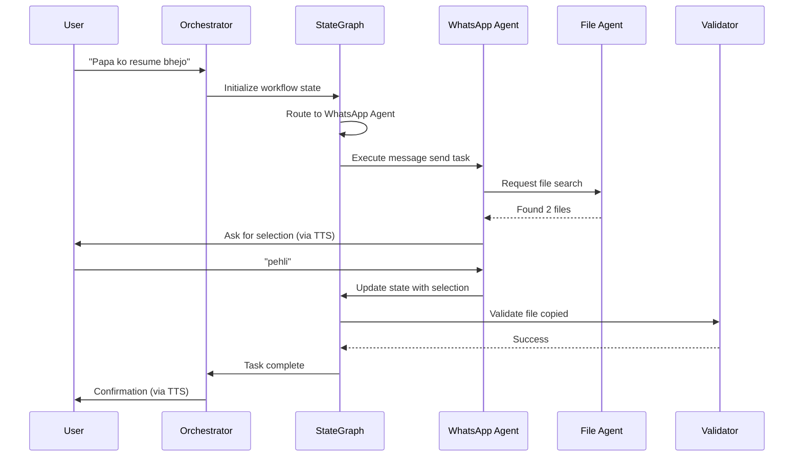

# Design Document: LangGraph and AutoGen Integration for Kypzer AI

## Overview

This design integrates **LangGraph** (graph-based workflow orchestration) and **AutoGen** (multi-agent framework) into Kypzer AI to replace the current linear command execution flow with an intelligent multi-agent system. The integration adds autonomous task planning, agent specialization by domain (PC control, WhatsApp, Screen AI, etc.), retry mechanisms, and graph-based state management while maintaining backward compatibility with existing features.

## Architecture

### High-Level System Architecture



### Current vs Proposed Flow

**Current (Linear)**:
```
User → STT → [Fast Route OR Intent OR Brain] → Actions → TTS
```

**Proposed (Graph-Based Multi-Agent)**:
```
User → STT → Orchestrator → StateGraph → Agent Selector → Specialized Agents → Validation → Retry/Success → TTS
```

### Agent Collaboration Example



## Components and Interfaces

### 1. Orchestrator Agent (Central Coordinator)

**Purpose**: Entry point for all commands, decides routing strategy, coordinates specialized agents

**Interface**:
```python
class OrchestratorAgent:
    def __init__(self, llm_config: dict, agent_registry: AgentRegistry):
        """Initialize orchestrator with LLM and agent registry"""
        pass
    
    def process_command(self, user_input: str, context: dict) -> CommandResult:
        """
        Process user command and route to appropriate handler
        
        Args:
            user_input: Transcribed text from user
            context: Conversation context and state
            
        Returns:
            CommandResult with response and execution steps
        """
        pass
    
    def should_use_fast_route(self, command: str) -> bool:
        """Check if command matches fast route pattern"""
        pass
    
    def create_workflow_graph(self, command: str) -> StateGraph:
        """Create LangGraph workflow for complex commands"""
        pass
```

**Responsibilities**:
- Command classification (fast route vs graph workflow)
- Agent selection and coordination
- State management across conversation
- Error handling and recovery


### 2. LangGraph State Manager

**Purpose**: Manages workflow state, handles transitions, enables conditional routing

**Interface**:
```python
from typing import TypedDict, Annotated
from langgraph.graph import StateGraph, END

class WorkflowState(TypedDict):
    """State passed between graph nodes"""
    user_input: str
    command_type: str
    agent_responses: list[dict]
    current_step: int
    retry_count: int
    context: dict
    final_result: dict | None

class StateManager:
    def __init__(self):
        """Initialize state graph with nodes and edges"""
        pass
    
    def build_graph(self) -> StateGraph:
        """
        Build LangGraph workflow
        
        Returns:
            Compiled state graph ready for execution
        """
        pass
    
    def route_command(self, state: WorkflowState) -> str:
        """Conditional routing based on command type"""
        pass
    
    def should_retry(self, state: WorkflowState) -> bool:
        """Determine if failed step should retry"""
        pass
```


### 3. Specialized AutoGen Agents

**Purpose**: Domain-specific agents that handle specific task categories

#### 3.1 PC Control Agent

**Interface**:
```python
from autogen import AssistantAgent

class PCControlAgent(AssistantAgent):
    def __init__(self, name: str, llm_config: dict, action_executor):
        """Agent for volume, brightness, WiFi, apps, etc."""
        super().__init__(name=name, llm_config=llm_config)
        self.action_executor = action_executor
    
    def execute_system_command(self, action: str, params: dict) -> dict:
        """
        Execute PC control actions
        
        Args:
            action: Action type (VOLUME_UP, OPEN_APP, etc.)
            params: Action parameters (target, value)
            
        Returns:
            Execution result with success status
        """
        pass
```

#### 3.2 WhatsApp Agent

**Interface**:
```python
class WhatsAppAgent(AssistantAgent):
    def __init__(self, name: str, llm_config: dict, wa_handler):
        """Agent for WhatsApp messaging, files, voice notes"""
        super().__init__(name=name, llm_config=llm_config)
        self.wa_handler = wa_handler
    
    def send_message(self, contact: str, message: str) -> dict:
        """Send text message"""
        pass
    
    def send_voice_note(self, contact: str, text: str) -> dict:
        """Send voice note"""
        pass
    
    def send_file_smart(self, command: str) -> dict:
        """Search and send file with voice selection"""
        pass
```


#### 3.3 Screen AI Agent

**Interface**:
```python
class ScreenAIAgent(AssistantAgent):
    def __init__(self, name: str, llm_config: dict, screen_ai_module):
        """Agent for vision-based UI interaction"""
        super().__init__(name=name, llm_config=llm_config)
        self.screen_ai = screen_ai_module
    
    def find_and_click(self, element_description: str) -> dict:
        """Locate and click UI element"""
        pass
    
    def type_in_field(self, text: str, field_desc: str) -> dict:
        """Find input field and type text"""
        pass
    
    def wait_for_condition(self, condition: str, timeout: int) -> dict:
        """Wait for visual condition to be met"""
        pass
```

#### 3.4 Web Agent

**Interface**:
```python
class WebAgent(AssistantAgent):
    def __init__(self, name: str, llm_config: dict):
        """Agent for web searches, URLs, browser automation"""
        super().__init__(name=name, llm_config=llm_config)
    
    def search(self, query: str) -> dict:
        """Perform web search"""
        pass
    
    def open_url(self, url: str) -> dict:
        """Open specific URL"""
        pass
```

#### 3.5 Memory Agent

**Interface**:
```python
class MemoryAgent(AssistantAgent):
    def __init__(self, name: str, llm_config: dict, memory_store):
        """Agent for conversation memory and context"""
        super().__init__(name=name, llm_config=llm_config)
        self.memory = memory_store
    
    def save_conversation(self, user_msg: str, response: str) -> dict:
        """Save to ChromaDB"""
        pass
    
    def retrieve_context(self, query: str) -> str:
        """Get relevant past conversations"""
        pass
```


### 4. Agent Registry

**Purpose**: Centralized agent management and discovery

**Interface**:
```python
class AgentRegistry:
    def __init__(self):
        """Initialize registry with all specialized agents"""
        self.agents: dict[str, AssistantAgent] = {}
    
    def register(self, agent_type: str, agent: AssistantAgent):
        """Register a new agent"""
        pass
    
    def get_agent(self, agent_type: str) -> AssistantAgent:
        """Retrieve agent by type"""
        pass
    
    def get_agent_for_command(self, command: str) -> AssistantAgent:
        """
        Intelligent agent selection based on command
        
        Returns:
            Most suitable agent for the command
        """
        pass
```

## Data Models

### WorkflowState

```python
from typing import TypedDict, Literal

class WorkflowState(TypedDict):
    # User input
    user_input: str
    original_audio_path: str | None
    
    # Classification
    command_type: Literal["simple", "complex", "multi_step"]
    intent: str | None
    confidence: float
    
    # Agent execution
    assigned_agent: str | None
    agent_responses: list[dict]
    current_step: int
    max_steps: int
    
    # Retry logic
    retry_count: int
    max_retries: int
    last_error: str | None
    
    # Context
    conversation_history: list[dict]
    relevant_context: str | None
    
    # Results
    final_result: dict | None
    tts_response: str | None
```


### AgentResponse

```python
from dataclasses import dataclass
from typing import Any

@dataclass
class AgentResponse:
    """Response from agent execution"""
    success: bool
    agent_name: str
    action_taken: str
    result: Any
    error: str | None = None
    retry_recommended: bool = False
    next_agent: str | None = None
```

### CommandClassification

```python
@dataclass
class CommandClassification:
    """Result of command analysis"""
    command_type: str
    intent: str
    confidence: float
    requires_agents: list[str]
    estimated_steps: int
    use_fast_route: bool
```

## Algorithmic Pseudocode

### Main Orchestration Algorithm

```python
def process_user_command(user_input: str, context: dict) -> dict:
    """
    Main orchestration algorithm using LangGraph + AutoGen
    
    INPUT: user_input (transcribed command), context (conversation state)
    OUTPUT: dict with response and execution results
    """
    # STEP 1: Check fast route cache
    if should_use_fast_route(user_input):
        return execute_fast_route(user_input)
    
    # STEP 2: Classify command
    classification = orchestrator.classify_command(user_input, context)
    
    # STEP 3: Initialize workflow state
    state = WorkflowState(
        user_input=user_input,
        command_type=classification.command_type,
        intent=classification.intent,
        confidence=classification.confidence,
        agent_responses=[],
        current_step=0,
        retry_count=0,
        max_retries=3,
        conversation_history=context.get("history", []),
        final_result=None
    )
    
    # STEP 4: Build and execute state graph
    graph = state_manager.build_graph()
    result = graph.invoke(state)
    
    # STEP 5: Extract and return response
    return {
        "say": result["tts_response"],
        "success": result["final_result"]["success"],
        "steps_executed": len(result["agent_responses"])
    }
```


### LangGraph State Graph Building

```python
def build_state_graph() -> StateGraph:
    """
    Build LangGraph workflow with nodes and conditional edges
    
    PRECONDITIONS:
    - All agents are registered in agent_registry
    - State schema is properly defined
    
    POSTCONDITIONS:
    - Returns compiled graph ready for execution
    - All nodes have defined transitions
    """
    graph = StateGraph(WorkflowState)
    
    # Add nodes
    graph.add_node("classify", classify_command_node)
    graph.add_node("route", route_to_agent_node)
    graph.add_node("execute", execute_agent_node)
    graph.add_node("validate", validate_result_node)
    graph.add_node("retry", retry_handler_node)
    graph.add_node("finalize", finalize_response_node)
    
    # Add edges
    graph.set_entry_point("classify")
    graph.add_edge("classify", "route")
    graph.add_edge("route", "execute")
    graph.add_edge("execute", "validate")
    
    # Conditional edges
    graph.add_conditional_edges(
        "validate",
        should_retry,
        {
            "retry": "retry",
            "finalize": "finalize",
            "end": END
        }
    )
    graph.add_edge("retry", "execute")
    graph.add_edge("finalize", END)
    
    return graph.compile()
```


### Agent Selection and Execution

```python
def route_to_agent_node(state: WorkflowState) -> WorkflowState:
    """
    Select appropriate agent based on command type
    
    PRECONDITIONS:
    - state.command_type is classified
    - state.intent is identified
    
    POSTCONDITIONS:
    - state.assigned_agent contains selected agent name
    - Agent is ready for execution
    
    LOOP INVARIANTS:
    - state.current_step increments on each iteration
    - state.agent_responses grows with each agent call
    """
    command = state["user_input"]
    intent = state["intent"]
    
    # Pattern matching for agent selection
    if "whatsapp" in command.lower() or "message" in command.lower():
        agent_type = "whatsapp"
    elif "volume" in command.lower() or "brightness" in command.lower():
        agent_type = "pc_control"
    elif "search" in command.lower() or "open" in command.lower():
        agent_type = "web"
    elif "click" in command.lower() or "type" in command.lower():
        agent_type = "screen_ai"
    else:
        # Use LLM to determine best agent
        agent_type = orchestrator.select_agent_with_llm(command, intent)
    
    state["assigned_agent"] = agent_type
    return state


def execute_agent_node(state: WorkflowState) -> WorkflowState:
    """
    Execute assigned agent's task
    
    PRECONDITIONS:
    - state.assigned_agent is set
    - Agent exists in registry
    
    POSTCONDITIONS:
    - Agent response added to state.agent_responses
    - state.current_step incremented
    - On error: state.last_error is set
    """
    agent_type = state["assigned_agent"]
    agent = agent_registry.get_agent(agent_type)
    
    try:
        # AutoGen agent execution
        response = agent.generate_reply(
            messages=[{
                "role": "user",
                "content": state["user_input"]
            }],
            sender=None
        )
        
        # Parse and execute agent's decision
        result = agent.execute_task(response)
        
        state["agent_responses"].append({
            "agent": agent_type,
            "result": result,
            "success": result.get("success", False)
        })
        state["current_step"] += 1
        
    except Exception as e:
        state["last_error"] = str(e)
        state["agent_responses"].append({
            "agent": agent_type,
            "result": None,
            "success": False,
            "error": str(e)
        })
    
    return state
```


### Retry Logic with Backoff

```python
def should_retry(state: WorkflowState) -> str:
    """
    Determine if failed execution should retry
    
    PRECONDITIONS:
    - state.agent_responses contains at least one response
    - state.retry_count <= state.max_retries
    
    POSTCONDITIONS:
    - Returns "retry" if retry conditions met
    - Returns "finalize" if max retries reached
    - Returns "end" if successful
    """
    last_response = state["agent_responses"][-1]
    
    # Success path
    if last_response.get("success", False):
        return "finalize"
    
    # Check retry limit
    if state["retry_count"] >= state["max_retries"]:
        return "finalize"
    
    # Check if error is retryable
    error = state.get("last_error", "")
    retryable_errors = ["timeout", "network", "429", "rate_limit"]
    
    if any(err in error.lower() for err in retryable_errors):
        return "retry"
    
    return "finalize"


def retry_handler_node(state: WorkflowState) -> WorkflowState:
    """
    Handle retry with exponential backoff
    
    PRECONDITIONS:
    - Retry is recommended
    - state.retry_count < state.max_retries
    
    POSTCONDITIONS:
    - state.retry_count incremented
    - Backoff delay applied
    """
    import time
    
    state["retry_count"] += 1
    
    # Exponential backoff: 1s, 2s, 4s
    backoff_time = 2 ** (state["retry_count"] - 1)
    time.sleep(backoff_time)
    
    print(f"Retry attempt {state['retry_count']}/{state['max_retries']} after {backoff_time}s")
    
    return state
```


## Key Functions with Formal Specifications

### Function 1: orchestrator.classify_command()

```python
def classify_command(self, user_input: str, context: dict) -> CommandClassification:
    """
    Classify user command to determine routing strategy
    
    Args:
        user_input: Transcribed user command
        context: Conversation context
        
    Returns:
        CommandClassification with routing details
    """
    pass
```

**Preconditions:**
- `user_input` is non-empty string
- `context` is valid dict (may be empty)

**Postconditions:**
- Returns CommandClassification object
- `classification.confidence` is float between 0.0 and 1.0
- `classification.command_type` is one of ["simple", "complex", "multi_step"]
- `classification.requires_agents` is list of agent names needed

**Loop Invariants:** N/A (no loops)

### Function 2: state_manager.build_graph()

```python
def build_graph(self) -> StateGraph:
    """Build LangGraph workflow"""
    pass
```

**Preconditions:**
- All node functions are defined
- StateGraph class is imported from langgraph

**Postconditions:**
- Returns compiled StateGraph instance
- Graph has entry point defined
- All nodes have at least one outgoing edge
- No unreachable nodes exist

**Loop Invariants:** N/A


### Function 3: agent.execute_task()

```python
def execute_task(self, task_description: str) -> AgentResponse:
    """
    Execute agent-specific task
    
    Args:
        task_description: Natural language task description
        
    Returns:
        AgentResponse with execution result
    """
    pass
```

**Preconditions:**
- `task_description` is non-empty string
- Agent has access to required tools/functions
- Agent's LLM config is valid

**Postconditions:**
- Returns AgentResponse object
- `response.success` indicates execution status
- If `response.success == False`, then `response.error` is non-None
- `response.agent_name` matches agent's registered name

**Loop Invariants:**
- For multi-step tasks: All completed steps maintain valid state
- Intermediate results are stored correctly

### Function 4: agent_registry.get_agent_for_command()

```python
def get_agent_for_command(self, command: str) -> AssistantAgent:
    """
    Intelligent agent selection
    
    Args:
        command: User command text
        
    Returns:
        Most suitable AutoGen agent
    """
    pass
```

**Preconditions:**
- `command` is non-empty string
- At least one agent is registered
- Agent registry is initialized

**Postconditions:**
- Returns AssistantAgent instance
- Returned agent has capability to handle command
- If no suitable agent found, returns default orchestrator agent

**Loop Invariants:**
- During agent scoring: All agents evaluated have valid scores
- Highest scoring agent is tracked throughout iteration


## Example Usage

### Example 1: Simple Command (Fast Route Preserved)

```python
# User: "Volume badha"
user_input = "Volume badha"

# Fast route check (unchanged from current system)
if orchestrator.should_use_fast_route(user_input):
    result = execute_fast_route(user_input)
    # {"say": "वॉल्यूम बढ़ा दिया!", "success": True}

# No graph overhead for simple commands
```

### Example 2: Complex WhatsApp Command (Multi-Agent)

```python
# User: "Papa ko resume bhejo"
user_input = "Papa ko resume bhejo"

# Initialize state
state = {
    "user_input": user_input,
    "command_type": "complex",
    "intent": "whatsapp_file_send",
    "agent_responses": [],
    "retry_count": 0
}

# Execute graph
graph = state_manager.build_graph()
result = graph.invoke(state)

# Graph execution:
# 1. classify → identifies "whatsapp_file_send"
# 2. route → selects WhatsAppAgent
# 3. execute → WhatsAppAgent delegates to FileSearchAgent
# 4. FileSearchAgent finds 2 files
# 5. WhatsAppAgent asks user for selection
# 6. User responds: "pehli"
# 7. WhatsAppAgent sends first file
# 8. validate → confirms success
# 9. finalize → generates response

# result["tts_response"] = "resume.pdf bhej diya!"
```

### Example 3: Multi-Step with Retry

```python
# User: "YouTube pe latest tech video play karo"
user_input = "YouTube pe latest tech video play karo"

state = {
    "user_input": user_input,
    "command_type": "multi_step",
    "agent_responses": [],
    "retry_count": 0,
    "max_retries": 3
}

graph = state_manager.build_graph()
result = graph.invoke(state)

# Execution flow:
# 1. WebAgent opens YouTube
# 2. ScreenAIAgent finds search box (fails - element not found)
# 3. should_retry() returns "retry"
# 4. retry_handler applies 1s backoff
# 5. ScreenAIAgent retries (success)
# 6. ScreenAIAgent types search query
# 7. ScreenAIAgent clicks first video
# 8. validate → success
# 9. finalize → "YouTube par tech video play kar diya"
```


### Example 4: Agent Collaboration (WhatsApp + File + Screen AI)

```python
# User: "Papa ko screenshot bhejo"
user_input = "Papa ko screenshot bhejo"

# Graph orchestrates multiple agents:
# 1. classify → "whatsapp_file_send" with screenshot prerequisite
# 2. route → determines agent sequence: ScreenAI → WhatsApp
# 3. ScreenAIAgent takes screenshot
# 4. WhatsAppAgent searches for screenshot file
# 5. WhatsAppAgent sends to "papa"
# 6. validate → confirms delivery
# 7. finalize → "Screenshot papa ko bhej diya"

result = orchestrator.process_command(user_input, context)
# Multiple agents collaborated seamlessly
```

## Correctness Properties

*A property is a characteristic or behavior that should hold true across all valid executions of a system-essentially, a formal statement about what the system should do. Properties serve as the bridge between human-readable specifications and machine-verifiable correctness guarantees.*

### Property 1: Command Classification Validity

*For any* user command, when classified by the Orchestrator, the classification SHALL return a command_type of "simple", "complex", or "multi_step" with confidence between 0.0 and 1.0.

**Validates: Requirements 1.1, 1.4**

### Property 2: Fast Route Bypass

*For any* command that matches a fast route pattern, the system SHALL execute without creating a StateGraph instance and SHALL complete within 500 milliseconds.

**Validates: Requirements 1.2, 11.1, 11.2, 14.1**

### Property 3: Non-Fast Route Graph Creation

*For any* command that does not match fast route patterns, the Orchestrator SHALL create and execute a StateGraph workflow.

**Validates: Requirements 1.3**

### Property 4: Execution Timeout Enforcement

*For any* command processed by the Orchestrator, execution SHALL complete within 10 seconds or return a timeout error.

**Validates: Requirements 1.5, 30.2**

### Property 5: State Monotonic Progression

*For any* StateGraph execution, when a state transition occurs, the current_step counter SHALL be monotonically increasing (never decreasing).

**Validates: Requirements 2.3, 19.4**

### Property 6: State Object Persistence

*For any* StateGraph execution, a WorkflowState object SHALL exist and be maintained throughout all state transitions.

**Validates: Requirements 2.2**

### Property 7: Terminal State Completeness

*For any* graph execution that completes, the WorkflowState SHALL contain a non-null final_result field.

**Validates: Requirements 2.4, 19.5**

### Property 8: Conditional Retry Routing

*For any* node failure, if retry conditions are met (retry_count < max_retries and error is retryable), the StateGraph SHALL route to the retry node.

**Validates: Requirements 2.5, 9.2**

### Property 9: Agent Registry Round-Trip

*For any* agent registered in the AgentRegistry with a unique agent_type, retrieving by that agent_type SHALL return the same agent instance.

**Validates: Requirements 3.1, 3.2**

### Property 10: Keyword-Based Routing Correctness

*For any* command containing keywords "whatsapp"/"message" → WhatsAppAgent, "volume"/"brightness" → PCControlAgent, "search"/"open" → WebAgent, or "click"/"type" → ScreenAIAgent, the Orchestrator SHALL route to the corresponding agent.

**Validates: Requirements 10.1, 10.2, 10.3, 10.4**

### Property 11: PC Control Action Mapping

*For any* volume or brightness command, the PCControlAgent SHALL execute one of the valid actions (VOLUME_UP/DOWN/SET or BRIGHTNESS_UP/DOWN/SET).

**Validates: Requirements 4.1, 4.2**

### Property 12: Agent Response Structure

*For any* agent execution, the returned AgentResponse SHALL contain success status, agent_name, action_taken, and result fields.

**Validates: Requirements 4.4, 5.6, 7.4**

### Property 13: WhatsApp Message Send

*For any* message send request, the WhatsAppAgent SHALL invoke the message sending mechanism with the specified contact and message text.

**Validates: Requirements 5.1**

### Property 14: ScreenAI Vision-Based Interaction

*For any* click or type request, the ScreenAIAgent SHALL locate the target element using vision before executing the interaction.

**Validates: Requirements 6.1, 6.2**

### Property 15: Web Search Execution

*For any* web search request, the WebAgent SHALL perform the search and complete within 3 seconds.

**Validates: Requirements 7.1, 7.3**

### Property 16: Memory Persistence

*For any* completed conversation, the MemoryAgent SHALL save both the user message and system response to ChromaDB with timestamp metadata.

**Validates: Requirements 8.1, 8.5**

### Property 17: Retry Count Bounded

*For any* workflow execution with failures, the retry_count SHALL never exceed max_retries.

**Validates: Requirements 9.3, 19.3**

### Property 18: Exponential Backoff Formula

*For any* retry scheduled by the RetryHandler, the backoff delay SHALL be exactly 2^(retry_count - 1) seconds.

**Validates: Requirements 9.4**

### Property 19: Performance Response Times

*For any* simple agent command, response time SHALL be less than 2 seconds; for multi-agent commands, less than 5 seconds; for complex workflows, less than 10 seconds.

**Validates: Requirements 14.2, 14.3, 14.4**

### Property 20: Authorization Validation

*For any* agent action attempt, the system SHALL verify the action exists in the agent's allowed_actions list before execution.

**Validates: Requirements 15.1**

### Property 21: Input Sanitization

*For any* user input received, the system SHALL sanitize it to remove potential prompt injection patterns before processing.

**Validates: Requirements 15.4, 26.1, 26.2**

### Property 22: Message Signature Validation

*For any* agent message exchange, the receiving agent SHALL validate the HMAC signature before processing the message content.

**Validates: Requirements 15.5, 27.2, 27.3**

### Property 23: Fast Route Action Compatibility

*For any* fast route pattern execution, the system SHALL use the existing actions.py function implementations.

**Validates: Requirements 16.2**

### Property 24: State Field Completeness

*For any* WorkflowState during execution, all required fields (user_input, command_type, agent_responses, current_step, retry_count, max_retries) SHALL be present.

**Validates: Requirements 19.1**

### Property 25: Agent Responses Append-Only

*For any* WorkflowState, the agent_responses list SHALL only grow (append operations only), never shrinking or modifying existing entries.

**Validates: Requirements 19.2**

### Property 26: Multi-Agent State Propagation

*For any* multi-agent task, when an agent completes its task, the WorkflowState SHALL be updated with the agent's result before the next agent begins execution.

**Validates: Requirements 13.2**

### Property 27: Agent Data Availability

*For any* agent requiring data from a previous agent, the required data SHALL be available in WorkflowState.agent_responses.

**Validates: Requirements 13.3**

### Property 28: WorkflowState Serialization Round-Trip

*For any* valid WorkflowState object, serializing then deserializing SHALL produce an equivalent object (parse(serialize(state)) ≡ state).

**Validates: Requirements 28.2, 28.3**

### Property 29: Error Capture Consistency

*For any* agent execution failure, the error SHALL be captured in WorkflowState.last_error.

**Validates: Requirements 12.1**

### Property 30: User Feedback on Errors

*For any* error that occurs during execution, the system SHALL provide a user-friendly TTS response explaining the issue.

**Validates: Requirements 12.5**


## Error Handling

### Error Scenario 1: Agent Execution Failure

**Condition**: Agent fails to execute task (timeout, exception, invalid response)

**Response**: 
- Capture error in `state.last_error`
- Check if error is retryable
- If retryable and under retry limit → retry with backoff
- If not retryable or max retries reached → graceful degradation

**Recovery**:
```python
def handle_agent_failure(state: WorkflowState) -> WorkflowState:
    error = state["last_error"]
    
    # Log error
    logger.error(f"Agent {state['assigned_agent']} failed: {error}")
    
    # Try alternative agent if available
    alternative = get_alternative_agent(state["assigned_agent"])
    if alternative:
        state["assigned_agent"] = alternative
        state["retry_count"] = 0  # Reset for new agent
        return state
    
    # Fallback to direct execution (current system)
    state["final_result"] = execute_legacy_fallback(state["user_input"])
    return state
```

### Error Scenario 2: LangGraph State Transition Error

**Condition**: Invalid state transition or missing node

**Response**:
- Catch StateGraphException
- Log graph structure for debugging
- Fall back to linear execution

**Recovery**:
```python
try:
    result = graph.invoke(state)
except StateGraphException as e:
    logger.error(f"Graph execution failed: {e}")
    # Fallback to current linear system
    result = brain.process_multimodal(text_input=user_input)
```

### Error Scenario 3: AutoGen Agent Configuration Error

**Condition**: Agent initialization fails (invalid LLM config, missing API key)

**Response**:
- Use default Gemini configuration
- Disable affected agent
- Continue with remaining agents

**Recovery**:
```python
def initialize_agents_with_fallback():
    agents = {}
    
    for agent_type in ["pc_control", "whatsapp", "screen_ai", "web"]:
        try:
            agents[agent_type] = create_agent(agent_type, llm_config)
        except Exception as e:
            logger.warning(f"Failed to initialize {agent_type} agent: {e}")
            # Use basic agent without AutoGen
            agents[agent_type] = BasicAgent(agent_type)
    
    return agents
```


### Error Scenario 4: Circular Agent Dependencies

**Condition**: Agent A requires Agent B, which requires Agent A (deadlock)

**Response**:
- Detect circular dependencies during graph building
- Raise CircularDependencyError
- Prevent graph compilation

**Recovery**:
```python
def validate_agent_dependencies(agent_graph: dict) -> bool:
    """
    Check for circular dependencies using DFS
    
    Returns:
        True if no cycles, False if circular dependency detected
    """
    visited = set()
    rec_stack = set()
    
    def has_cycle(agent: str) -> bool:
        visited.add(agent)
        rec_stack.add(agent)
        
        for dependent in agent_graph.get(agent, []):
            if dependent not in visited:
                if has_cycle(dependent):
                    return True
            elif dependent in rec_stack:
                return True
        
        rec_stack.remove(agent)
        return False
    
    for agent in agent_graph:
        if agent not in visited:
            if has_cycle(agent):
                raise CircularDependencyError(f"Circular dependency detected involving {agent}")
    
    return True
```

## Testing Strategy

### Unit Testing Approach

**Test Coverage**:
1. Each AutoGen agent class
2. State graph node functions
3. Orchestrator routing logic
4. Agent registry operations
5. Retry mechanism

**Sample Test Cases**:

```python
import pytest
from unittest.mock import Mock, patch

def test_orchestrator_fast_route_detection():
    """Test that simple commands use fast route"""
    orchestrator = OrchestratorAgent(llm_config, agent_registry)
    
    # Test cases
    assert orchestrator.should_use_fast_route("volume up") == True
    assert orchestrator.should_use_fast_route("papa ko resume bhejo") == False
    assert orchestrator.should_use_fast_route("brightness badha") == True

def test_agent_selection():
    """Test correct agent is selected for command"""
    registry = AgentRegistry()
    registry.register("whatsapp", WhatsAppAgent(...))
    registry.register("pc_control", PCControlAgent(...))
    
    # WhatsApp command should route to WhatsApp agent
    agent = registry.get_agent_for_command("papa ko message bhejo")
    assert agent.name == "whatsapp"
    
    # Volume command should route to PC control agent
    agent = registry.get_agent_for_command("volume 50% set karo")
    assert agent.name == "pc_control"

def test_retry_logic():
    """Test retry mechanism with backoff"""
    state = {
        "retry_count": 0,
        "max_retries": 3,
        "agent_responses": [{"success": False, "error": "timeout"}]
    }
    
    # Should retry on timeout
    assert should_retry(state) == "retry"
    
    # Should not retry after max retries
    state["retry_count"] = 3
    assert should_retry(state) == "finalize"
```


### Property-Based Testing Approach

**Property Test Library**: Hypothesis

**Properties to Test**:

1. **State Invariants**: State transitions always maintain valid structure
2. **Idempotency**: Retrying same command yields same result
3. **Termination**: All graph executions complete within timeout
4. **Agent Selection**: Selected agent always has required capabilities

**Sample Property Tests**:

```python
from hypothesis import given, strategies as st

@given(st.text(min_size=1, max_size=100))
def test_classify_command_returns_valid_classification(command):
    """Property: Classification always returns valid structure"""
    orchestrator = OrchestratorAgent(llm_config, agent_registry)
    
    classification = orchestrator.classify_command(command, {})
    
    # Properties that must hold
    assert 0.0 <= classification.confidence <= 1.0
    assert classification.command_type in ["simple", "complex", "multi_step"]
    assert isinstance(classification.requires_agents, list)
    assert classification.estimated_steps >= 1

@given(st.integers(min_value=0, max_value=10))
def test_retry_count_never_exceeds_max(initial_retry_count):
    """Property: Retry count never exceeds max_retries"""
    state = {
        "retry_count": initial_retry_count,
        "max_retries": 3,
        "agent_responses": [{"success": False}]
    }
    
    # Process through retry handler
    for _ in range(10):  # Try many times
        if should_retry(state) == "retry":
            state = retry_handler_node(state)
    
    assert state["retry_count"] <= state["max_retries"]

@given(st.lists(st.text(min_size=1, max_size=50), min_size=1, max_size=10))
def test_agent_responses_grow_monotonically(commands):
    """Property: Agent responses list only grows, never shrinks"""
    state = {"agent_responses": [], "current_step": 0}
    
    for cmd in commands:
        prev_len = len(state["agent_responses"])
        state = execute_agent_node(state)
        assert len(state["agent_responses"]) >= prev_len
```

### Integration Testing Approach

**Test Scenarios**:

1. **End-to-End Command Execution**
   - User input → Final response with all components integrated

2. **Multi-Agent Collaboration**
   - Test agent handoffs and data sharing

3. **Fallback to Legacy System**
   - Verify backward compatibility when graph fails

**Sample Integration Tests**:

```python
@pytest.mark.integration
def test_end_to_end_whatsapp_file_send():
    """Integration test: WhatsApp file send with voice selection"""
    # Setup
    mock_mic = Mock()
    mock_mic.record_audio.return_value = "papa_ko_resume_bhejo.wav"
    
    mock_stt = Mock()
    mock_stt.transcribe_wav_google.return_value = ("papa ko resume bhejo", None)
    
    mock_file_search = Mock()
    mock_file_search.search_files.return_value = [
        {"name": "resume.pdf", "path": "C:/Documents/resume.pdf"}
    ]
    
    # Execute full flow
    with patch('mic.record_audio', mock_mic.record_audio):
        with patch('stt.transcribe_wav_google', mock_stt.transcribe_wav_google):
            with patch('whatsapp_module.file_search.search_files', mock_file_search.search_files):
                result = orchestrator.process_command("papa ko resume bhejo", {})
    
    # Verify
    assert result["success"] == True
    assert "bhej diya" in result["say"]
    assert len(result["steps_executed"]) >= 2  # File search + WhatsApp send
```


## Performance Considerations

### 1. Fast Route Preservation

**Goal**: Maintain sub-second response for simple commands

**Implementation**:
```python
# Cache common patterns for O(1) lookup
FAST_ROUTE_CACHE = {
    "volume up": {"action": "VOLUME_UP", "agent": None},
    "volume down": {"action": "VOLUME_DOWN", "agent": None},
    "brightness badha": {"action": "BRIGHTNESS_UP", "agent": None},
    # ... 50+ patterns
}

def should_use_fast_route(command: str) -> bool:
    """Check cache before agent orchestration"""
    normalized = command.lower().strip()
    return normalized in FAST_ROUTE_CACHE
```

**Expected Performance**:
- Fast route commands: <500ms (unchanged)
- Graph-based commands: 2-4s (current: 2-3s)
- Multi-agent commands: 3-6s (new capability)

### 2. Agent Initialization

**Challenge**: AutoGen agents have initialization overhead

**Solution**: Lazy initialization + singleton pattern

```python
class AgentRegistry:
    _instances = {}
    
    def get_agent(self, agent_type: str) -> AssistantAgent:
        """Lazy initialization - create agent on first use"""
        if agent_type not in self._instances:
            self._instances[agent_type] = self._create_agent(agent_type)
        return self._instances[agent_type]
```

### 3. State Graph Compilation

**Challenge**: Graph compilation adds latency

**Solution**: Pre-compile graph at startup

```python
# Compile once at application start
COMPILED_GRAPH = None

def initialize_system():
    global COMPILED_GRAPH
    state_manager = StateManager()
    COMPILED_GRAPH = state_manager.build_graph()
    print("✅ LangGraph compiled and ready")

# Reuse compiled graph for all commands
def process_command(user_input: str):
    result = COMPILED_GRAPH.invoke(initial_state)
```

### 4. LLM API Optimization

**Challenge**: Each agent call hits LLM API

**Solution**: 
- Batch agent decisions when possible
- Cache agent responses for similar commands
- Use cheaper models for simple decisions

```python
# Use fast model for routing, full model for execution
LLM_CONFIG_ROUTING = {
    "model": "gemini-2.0-flash-lite",  # Fast, cheap
    "temperature": 0.1
}

LLM_CONFIG_EXECUTION = {
    "model": "gemini-2.5-flash",  # Full capability
    "temperature": 0.3
}
```

### 5. Memory Integration

**Challenge**: Context retrieval adds latency

**Solution**: Async context loading

```python
import asyncio

async def get_context_async(query: str) -> str:
    """Non-blocking context retrieval"""
    return await asyncio.to_thread(memory.get_relevant_context, query)

# Load context in parallel with classification
async def process_with_context(user_input: str):
    context_task = get_context_async(user_input)
    classification = classify_command(user_input)
    context = await context_task
    # Both ready simultaneously
```


## Security Considerations

### 1. Agent Authority Limits

**Threat**: Malicious commands could abuse agent capabilities

**Mitigation**: Role-based access control for agents

```python
class AgentCapabilities:
    """Define what each agent can do"""
    PC_CONTROL = ["volume", "brightness", "apps", "media"]
    WHATSAPP = ["send_message", "send_file", "send_voice_note"]
    SCREEN_AI = ["click", "type", "screenshot"]
    WEB = ["search", "open_url"]
    MEMORY = ["read_context", "save_conversation"]

class SecureAgent(AssistantAgent):
    def __init__(self, name: str, allowed_actions: list[str], **kwargs):
        super().__init__(name=name, **kwargs)
        self.allowed_actions = allowed_actions
    
    def execute_task(self, task: str) -> AgentResponse:
        """Validate action before execution"""
        action = self._parse_action(task)
        
        if action not in self.allowed_actions:
            raise UnauthorizedActionError(f"{self.name} cannot perform {action}")
        
        return super().execute_task(task)
```

### 2. Sensitive Command Confirmation

**Threat**: Accidental system shutdown, file deletion

**Mitigation**: Require explicit confirmation for destructive actions

```python
DANGEROUS_ACTIONS = ["SHUTDOWN", "RESTART", "DELETE_FILE", "FORMAT_DRIVE"]

def execute_action(action: str, target: str, value: any):
    """Enhanced with confirmation for dangerous actions"""
    if action in DANGEROUS_ACTIONS:
        # Require voice confirmation
        tts.speak(f"This will {action}. Say 'confirm' to proceed.")
        confirmation = mic.listen_once()
        
        if "confirm" not in confirmation.lower():
            tts.speak("Action cancelled.")
            return {"success": False, "reason": "not_confirmed"}
    
    # Proceed with action
    return original_execute_action(action, target, value)
```

### 3. API Key Rotation

**Threat**: Key leakage, rate limiting

**Mitigation**: Secure key storage + rotation (already implemented in brain.py)

```python
# Keep existing multi-key rotation from brain.py
# Add encryption for stored keys
from cryptography.fernet import Fernet

class SecureConfig:
    def __init__(self, encryption_key: bytes):
        self.cipher = Fernet(encryption_key)
    
    def get_api_key(self, service: str) -> str:
        """Decrypt and return API key"""
        encrypted = os.getenv(f"{service}_API_KEY_ENCRYPTED")
        return self.cipher.decrypt(encrypted.encode()).decode()
```

### 4. Agent Communication Security

**Threat**: Interception of agent messages

**Mitigation**: Signed agent messages

```python
import hmac
import hashlib

class SecureAgentMessage:
    def __init__(self, sender: str, content: str, secret: str):
        self.sender = sender
        self.content = content
        self.signature = self._sign(content, secret)
    
    def _sign(self, content: str, secret: str) -> str:
        """HMAC signature for message integrity"""
        return hmac.new(
            secret.encode(),
            content.encode(),
            hashlib.sha256
        ).hexdigest()
    
    def verify(self, secret: str) -> bool:
        """Verify message hasn't been tampered with"""
        expected = self._sign(self.content, secret)
        return hmac.compare_digest(self.signature, expected)
```

### 5. Prompt Injection Prevention

**Threat**: Malicious user input manipulating agent behavior

**Mitigation**: Input sanitization + prompt guards

```python
def sanitize_user_input(user_input: str) -> str:
    """Remove potential injection attempts"""
    # Remove system-level keywords
    dangerous_patterns = [
        r"ignore previous instructions",
        r"you are now",
        r"system prompt",
        r"sudo",
        r"<script>",
    ]
    
    sanitized = user_input
    for pattern in dangerous_patterns:
        sanitized = re.sub(pattern, "", sanitized, flags=re.IGNORECASE)
    
    return sanitized.strip()

# Add to orchestrator
def process_command(self, user_input: str, context: dict):
    user_input = sanitize_user_input(user_input)
    # Continue processing...
```


## Dependencies

### New Dependencies

```txt
# LangGraph for workflow orchestration
langgraph>=0.0.30
langchain>=0.1.0
langchain-core>=0.1.0

# AutoGen for multi-agent framework
pyautogen>=0.2.0

# Optional: Enhanced agent capabilities
langchain-google-genai>=0.0.5  # Gemini integration for AutoGen
```

### Dependency Integration

```python
# Example: Configure AutoGen with existing Gemini keys
from autogen import config_list_from_json

# Use existing Gemini API keys from brain.py
llm_config = {
    "config_list": [
        {
            "model": "gemini-2.5-flash",
            "api_key": API_KEYS[0],
            "api_type": "google"
        }
    ],
    "temperature": 0.3,
    "timeout": 120
}
```

### Existing Dependencies (Preserved)

- All current dependencies remain unchanged
- `google-generativeai` continues for brain.py fallback
- `chromadb` for memory
- `groq` for Screen AI
- All automation libraries (pyautogui, keyboard, etc.)

## Migration Strategy

### Phase 1: Add Infrastructure (Week 1)

1. Install LangGraph and AutoGen
2. Create agent base classes
3. Implement StateGraph structure
4. Add orchestrator without replacing current system

### Phase 2: Parallel Operation (Week 2-3)

1. Add feature flag: `USE_AGENT_SYSTEM = False`
2. Test both systems in parallel
3. Compare performance and accuracy
4. Gradual rollout by command type

```python
# Feature flag in main.py
USE_AGENT_SYSTEM = os.getenv("USE_AGENT_SYSTEM", "false").lower() == "true"

if USE_AGENT_SYSTEM and not should_use_fast_route(transcript):
    # New: Agent-based processing
    result = orchestrator.process_command(transcript, context)
else:
    # Current: Original flow
    result = brain.process_multimodal(text_input=transcript)
```

### Phase 3: Full Integration (Week 4)

1. Default to agent system for complex commands
2. Keep fast routes unchanged
3. Monitor error rates and performance
4. Rollback mechanism if issues arise

### Phase 4: Optimization (Week 5-6)

1. Fine-tune agent prompts
2. Optimize graph structure
3. Add agent collaboration patterns
4. Performance profiling and caching

## Backward Compatibility

### Preserved Features

1. **Fast Routes**: Unchanged, still bypass AI for simple commands
2. **Offline Intent**: Continues to work for 50+ patterns
3. **Direct Execution**: Falls back to current system on agent failure
4. **All Actions**: Existing actions.py functions remain functional
5. **Memory System**: ChromaDB integration stays the same
6. **API Keys**: Same .env configuration

### Breaking Changes

**None** - The integration is additive, not replacing existing code.

### Rollback Plan

```python
# Instant rollback via environment variable
if os.getenv("DISABLE_AGENT_SYSTEM", "false").lower() == "true":
    # Completely disable LangGraph/AutoGen
    USE_AGENT_SYSTEM = False
    print("⚠️ Agent system disabled, using legacy flow")
```


## Implementation Roadmap

### Week 1: Foundation

**Tasks**:
1. Install dependencies (langgraph, pyautogen)
2. Create `agents/` directory structure
3. Implement `OrchestratorAgent` base class
4. Implement `StateManager` with basic graph
5. Create `AgentRegistry`

**Deliverables**:
- `agents/orchestrator.py`
- `agents/state_manager.py`
- `agents/registry.py`
- Basic graph that can execute one agent

### Week 2: Specialized Agents

**Tasks**:
1. Implement `PCControlAgent`
2. Implement `WhatsAppAgent`
3. Implement `ScreenAIAgent`
4. Implement `WebAgent`
5. Implement `MemoryAgent`

**Deliverables**:
- `agents/pc_control_agent.py`
- `agents/whatsapp_agent.py`
- `agents/screen_ai_agent.py`
- `agents/web_agent.py`
- `agents/memory_agent.py`

### Week 3: Integration

**Tasks**:
1. Integrate orchestrator into `main.py`
2. Add feature flag for gradual rollout
3. Implement retry logic
4. Add validation nodes
5. Test end-to-end flows

**Deliverables**:
- Modified `main.py` with agent integration
- Unit tests for all agents
- Integration test suite

### Week 4: Advanced Features

**Tasks**:
1. Implement multi-agent collaboration
2. Add agent handoff mechanisms
3. Optimize graph execution
4. Add monitoring and logging
5. Performance benchmarking

**Deliverables**:
- Multi-agent workflows working
- Performance report
- Monitoring dashboard

### Week 5-6: Polish & Production

**Tasks**:
1. Security hardening
2. Error handling improvements
3. Documentation
4. User acceptance testing
5. Production deployment

**Deliverables**:
- Production-ready system
- Complete documentation
- User guide
- Deployment scripts

## Success Metrics

### Performance Metrics

1. **Response Time**
   - Fast route commands: <500ms (maintain current)
   - Simple agent commands: <2s
   - Multi-agent commands: <5s
   - Complex workflows: <10s

2. **Accuracy**
   - Command classification: >95% accuracy
   - Agent selection: >90% correct routing
   - Task completion: >85% success rate

3. **Reliability**
   - System uptime: >99%
   - Fallback activation: <5% of commands
   - Retry success rate: >70%

### User Experience Metrics

1. **Conversation Quality**
   - Context awareness: Relevant past conversations used >80% of time
   - Natural dialogue: Multi-turn conversations work seamlessly

2. **Feature Adoption**
   - Multi-step commands: Successfully handle 10+ new command types
   - Agent collaboration: 30%+ of complex commands use multiple agents

## Monitoring and Observability

### Logging Strategy

```python
import logging
from datetime import datetime

class AgentLogger:
    def __init__(self):
        self.logger = logging.getLogger("kypzer.agents")
        self.logger.setLevel(logging.INFO)
    
    def log_agent_execution(self, agent_name: str, command: str, result: dict):
        """Log every agent execution"""
        self.logger.info(
            f"[{datetime.now()}] Agent={agent_name} | Command={command} | "
            f"Success={result.get('success')} | Time={result.get('execution_time')}ms"
        )
    
    def log_graph_execution(self, state: WorkflowState):
        """Log complete graph execution"""
        self.logger.info(
            f"[{datetime.now()}] Graph Execution | Steps={state['current_step']} | "
            f"Retries={state['retry_count']} | Agents={[r['agent'] for r in state['agent_responses']]}"
        )
```

### Metrics Collection

```python
from collections import defaultdict
import time

class MetricsCollector:
    def __init__(self):
        self.metrics = defaultdict(list)
    
    def record_execution_time(self, command_type: str, execution_time: float):
        """Track execution times by command type"""
        self.metrics[f"exec_time_{command_type}"].append(execution_time)
    
    def record_agent_usage(self, agent_name: str):
        """Track agent usage frequency"""
        self.metrics["agent_usage"][agent_name] = self.metrics["agent_usage"].get(agent_name, 0) + 1
    
    def get_stats(self) -> dict:
        """Get aggregated statistics"""
        return {
            "avg_exec_time": sum(self.metrics["exec_time"]) / len(self.metrics["exec_time"]),
            "agent_usage": dict(self.metrics["agent_usage"]),
            "total_commands": len(self.metrics["exec_time"])
        }
```

## Conclusion

This design integrates LangGraph and AutoGen into Kypzer AI to create an intelligent multi-agent system while preserving all existing functionality and performance characteristics. The graph-based workflow enables complex multi-step tasks, autonomous planning, intelligent error recovery, and agent collaboration that were not possible in the current linear architecture.

Key benefits:
- **Intelligent Routing**: Automatic agent selection based on command analysis
- **Error Resilience**: Retry logic with exponential backoff
- **Extensibility**: Easy to add new agents for new capabilities
- **Maintainability**: Clear separation of concerns by domain
- **Performance**: Fast routes preserved for common commands
- **Backward Compatible**: Zero breaking changes, gradual migration

The implementation follows a phased approach with feature flags, allowing safe rollout and instant rollback if needed.
