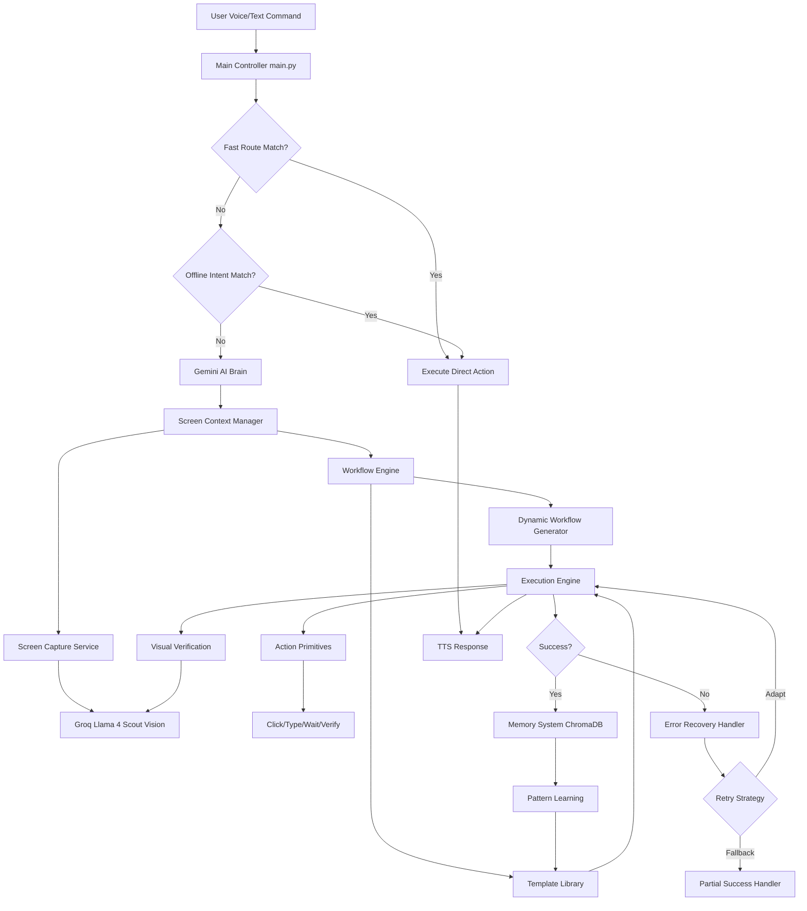
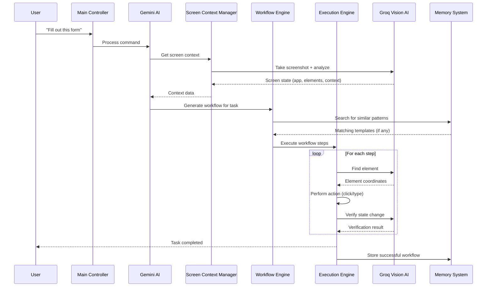
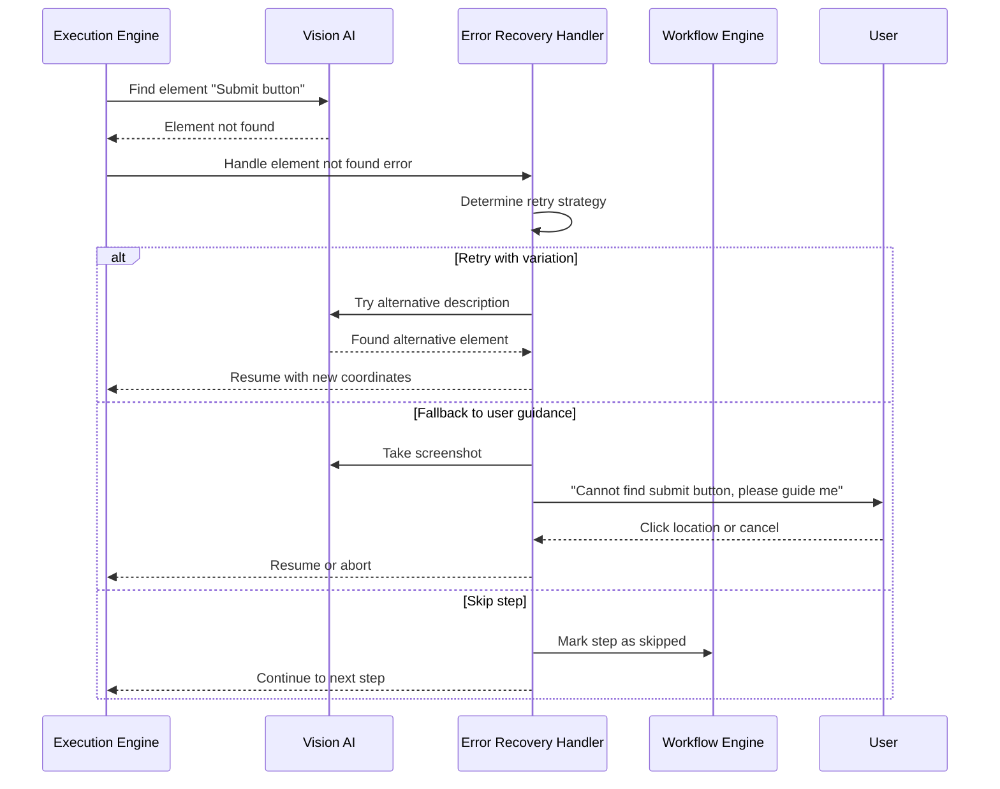

# Design Document: Screen Understanding Automation

## Overview

The Screen Understanding Automation feature enhances Kypzer AI's existing Vision AI capabilities to enable intelligent, context-aware screen understanding and dynamic multi-step task automation. Currently, Kypzer uses Groq Llama 4 Scout for basic screen capture and element finding, but relies on hardcoded coordinate workflows (like the 15-step Google Flow automation). This enhancement transforms the system from coordinate-based automation to intelligent, adaptive workflow execution that understands visual context, learns from patterns, and gracefully handles UI variations.

The system will enable Kypzer to understand what's on screen, execute complex multi-step workflows based on visual state, remember successful automation sequences, and respond to natural language commands like "Fill out this form", "Complete the checkout process", or "Find and download that file". This maintains Kypzer's speed-optimized 3-layer routing architecture (fast routes → offline intent → Gemini AI) while adding intelligent visual reasoning and adaptive execution capabilities.

## Architecture



## Sequence Diagrams

### Main Workflow: Natural Language Task Execution



### Error Recovery Flow



## Components and Interfaces

### Component 1: Screen Context Manager

**Purpose**: Manages screen capture, caching, and context extraction to provide real-time understanding of what's on screen.

**Interface**:
```python
class ScreenContextManager:
    def get_current_context(self, force_refresh: bool = False) -> ScreenContext
    def get_active_application(self) -> str
    def get_visible_elements(self, element_types: List[str] = None) -> List[UIElement]
    def take_annotated_screenshot(self) -> Tuple[bytes, Dict[str, Any]]
    def check_screen_state(self, expected_state: str) -> bool
    def wait_for_state_change(self, timeout: int = 30) -> bool
```

**Responsibilities**:
- Take screenshots with intelligent caching (avoid redundant captures)
- Extract high-level screen context (active app, window title, visible UI elements)
- Maintain screen state history for change detection
- Provide fast context queries without vision API calls when possible

### Component 2: Workflow Engine

**Purpose**: Generates, manages, and executes multi-step automation workflows.

**Interface**:
```python
class WorkflowEngine:
    def generate_workflow(self, task_description: str, context: ScreenContext) -> Workflow
    def execute_workflow(self, workflow: Workflow, options: ExecutionOptions = None) -> ExecutionResult
    def load_template(self, template_name: str) -> WorkflowTemplate
    def save_template(self, workflow: Workflow, template_name: str) -> bool
    def adapt_workflow(self, workflow: Workflow, error: ExecutionError) -> Workflow
```

**Responsibilities**:
- Translate natural language task descriptions into executable workflows
- Manage workflow templates for common tasks
- Handle workflow adaptation when steps fail
- Coordinate with execution engine and error recovery

### Component 3: Dynamic Workflow Generator

**Purpose**: Converts high-level task descriptions into step-by-step action sequences using AI reasoning.

**Interface**:
```python
class DynamicWorkflowGenerator:
    def generate_from_description(self, task: str, context: ScreenContext) -> List[WorkflowStep]
    def refine_workflow(self, workflow: List[WorkflowStep], feedback: str) -> List[WorkflowStep]
    def estimate_workflow_confidence(self, workflow: List[WorkflowStep]) -> float
```

**Responsibilities**:
- Use Gemini AI to break down complex tasks into steps
- Infer element descriptions and action sequences
- Estimate confidence for generated workflows
- Support iterative refinement based on execution feedback

### Component 4: Execution Engine

**Purpose**: Executes individual workflow steps with visual verification and state management.

**Interface**:
```python
class ExecutionEngine:
    def execute_step(self, step: WorkflowStep, context: ExecutionContext) -> StepResult
    def execute_with_retry(self, step: WorkflowStep, max_retries: int = 3) -> StepResult
    def verify_step_success(self, step: WorkflowStep, expected_outcome: str) -> bool
    def get_execution_state(self) -> ExecutionState
    def pause_execution(self) -> None
    def resume_execution(self) -> None
    def abort_execution(self) -> None
```

**Responsibilities**:
- Execute atomic actions (click, type, wait, verify)
- Provide visual verification after each action
- Manage execution state and progress tracking
- Support pause/resume/abort controls


### Component 5: Error Recovery Handler

**Purpose**: Handles failures gracefully with adaptive retry strategies and fallback mechanisms.

**Interface**:
```python
class ErrorRecoveryHandler:
    def handle_element_not_found(self, element: str, context: ScreenContext) -> RecoveryAction
    def handle_state_verification_failed(self, expected: str, actual: str) -> RecoveryAction
    def handle_timeout(self, step: WorkflowStep) -> RecoveryAction
    def suggest_alternative_action(self, failed_step: WorkflowStep) -> Optional[WorkflowStep]
    def request_user_guidance(self, error: ExecutionError) -> UserGuidance
```

**Responsibilities**:
- Determine appropriate recovery strategy based on error type
- Generate alternative actions when primary actions fail
- Request user guidance when automated recovery isn't possible
- Log failure patterns for learning

### Component 6: Pattern Learning System

**Purpose**: Learns from successful automation sequences and builds reusable templates.

**Interface**:
```python
class PatternLearningSystem:
    def record_successful_workflow(self, task: str, workflow: Workflow, context: ScreenContext) -> None
    def find_similar_patterns(self, task: str, context: ScreenContext) -> List[WorkflowTemplate]
    def create_template_from_workflow(self, workflow: Workflow, metadata: Dict[str, Any]) -> WorkflowTemplate
    def update_template_confidence(self, template_id: str, success: bool) -> None
    def get_most_reliable_template(self, task_type: str) -> Optional[WorkflowTemplate]
```

**Responsibilities**:
- Store successful workflows in ChromaDB with embeddings
- Match new tasks to historical patterns
- Automatically create templates from repeated tasks
- Track template success rates and confidence scores

## Data Models

### ScreenContext

```python
class ScreenContext:
    timestamp: float
    screenshot_base64: str
    screenshot_size: Tuple[int, int]
    active_application: str
    window_title: str
    visible_elements: List[UIElement]
    screen_state_hash: str
    
class UIElement:
    description: str
    element_type: str  # button, input, link, image, text, menu
    coordinates: Tuple[int, int]
    bounds: Tuple[int, int, int, int]  # x, y, width, height
    confidence: float
    text_content: Optional[str]
    attributes: Dict[str, Any]
```

**Validation Rules**:
- `screenshot_base64` must be valid base64-encoded JPEG
- `screenshot_size` must match actual image dimensions
- `coordinates` must be within screen bounds
- `confidence` must be between 0.0 and 1.0

### Workflow and WorkflowStep

```python
class Workflow:
    workflow_id: str
    task_description: str
    steps: List[WorkflowStep]
    created_at: float
    template_id: Optional[str]
    confidence: float
    metadata: Dict[str, Any]

class WorkflowStep:
    step_id: str
    action_type: str  # click, type, wait, verify, scroll, press_key
    target_element: str
    value: Optional[Any]
    verification: Optional[VerificationRule]
    timeout: int
    retry_policy: RetryPolicy
    fallback_steps: List[WorkflowStep]

class VerificationRule:
    condition_type: str  # element_visible, element_not_visible, text_present, state_changed
    condition_value: str
    timeout: int
```

**Validation Rules**:
- `workflow_id` must be unique UUID
- `action_type` must be one of predefined action types
- `timeout` must be positive integer
- `verification` is required for critical steps


### WorkflowTemplate

```python
class WorkflowTemplate:
    template_id: str
    name: str
    task_pattern: str  # regex or natural language pattern
    application_context: Optional[str]
    workflow: Workflow
    success_count: int
    failure_count: int
    confidence_score: float
    created_at: float
    last_used_at: float
    tags: List[str]

class ExecutionResult:
    success: bool
    completed_steps: int
    total_steps: int
    errors: List[ExecutionError]
    duration: float
    final_state: ScreenContext
    
class ExecutionError:
    step_id: str
    error_type: str  # element_not_found, timeout, verification_failed, unexpected_state
    error_message: str
    recovery_attempted: bool
    recovery_successful: bool
    screenshot: Optional[str]
```

## Algorithmic Pseudocode

### Main Algorithm: Natural Language Task Execution

```pascal
ALGORITHM executeNaturalLanguageTask(userCommand, screenContext)
INPUT: userCommand (string), screenContext (ScreenContext)
OUTPUT: result (ExecutionResult)

PRECONDITIONS:
  - userCommand is non-empty string
  - screenContext contains valid screenshot and context data
  - Vision AI service is available
  - Gemini AI service is available

POSTCONDITIONS:
  - If successful: result.success = true AND all workflow steps completed
  - If failed: result.errors contains detailed error information
  - Execution is recorded in memory system for learning

BEGIN
  ASSERT userCommand ≠ empty AND screenContext.screenshot_base64 ≠ empty
  
  // Step 1: Search for existing patterns
  similarPatterns ← patternLearningSystem.findSimilarPatterns(userCommand, screenContext)
  
  IF similarPatterns.length > 0 THEN
    // Use most reliable template
    template ← patternLearningSystem.getMostReliableTemplate(similarPatterns[0].taskType)
    workflow ← template.workflow
    workflow.metadata["source"] ← "template"
  ELSE
    // Generate new workflow dynamically
    workflow ← dynamicWorkflowGenerator.generateFromDescription(userCommand, screenContext)
    workflow.metadata["source"] ← "generated"
  END IF
  
  // Step 2: Execute workflow with error handling
  result ← workflowEngine.executeWorkflow(workflow)
  
  // Step 3: Learn from execution
  IF result.success THEN
    patternLearningSystem.recordSuccessfulWorkflow(userCommand, workflow, screenContext)
    
    IF workflow.metadata["source"] = "template" THEN
      patternLearningSystem.updateTemplateConfidence(workflow.templateId, true)
    ELSE IF isRepeatedTask(userCommand) THEN
      // Create template for future use
      patternLearningSystem.createTemplateFromWorkflow(workflow, {
        "task": userCommand,
        "confidence": result.confidence
      })
    END IF
  ELSE
    IF workflow.metadata["source"] = "template" THEN
      patternLearningSystem.updateTemplateConfidence(workflow.templateId, false)
    END IF
  END IF
  
  ASSERT result.completedSteps ≤ result.totalSteps
  ASSERT result.duration ≥ 0
  
  RETURN result
END
```

### Algorithm: Dynamic Workflow Generation

```pascal
ALGORITHM generateWorkflowFromDescription(taskDescription, screenContext)
INPUT: taskDescription (string), screenContext (ScreenContext)
OUTPUT: workflow (List<WorkflowStep>)

PRECONDITIONS:
  - taskDescription is clear and actionable
  - screenContext contains visible UI elements
  - Gemini AI is available for reasoning

POSTCONDITIONS:
  - workflow contains ordered list of executable steps
  - Each step has valid action_type and target_element
  - Workflow includes verification steps for critical actions

BEGIN
  ASSERT taskDescription ≠ empty
  
  workflow ← empty list
  
  // Step 1: Use Gemini AI to decompose task
  prompt ← buildWorkflowGenerationPrompt(taskDescription, screenContext)
  aiResponse ← geminiAI.generateContent(prompt)
  rawSteps ← parseAIResponse(aiResponse)
  
  // Step 2: Enhance each step with verification and retry logic
  FOR each rawStep IN rawSteps DO
    step ← new WorkflowStep()
    step.actionType ← rawStep.action
    step.targetElement ← rawStep.target
    step.value ← rawStep.value
    
    // Add verification for state-changing actions
    IF rawStep.action IN ["click", "type", "press_key"] THEN
      step.verification ← inferVerificationRule(rawStep, screenContext)
      step.timeout ← 10
      step.retryPolicy ← new RetryPolicy(maxRetries: 3, strategy: "exponential_backoff")
    ELSE IF rawStep.action = "wait" THEN
      step.timeout ← rawStep.value OR 5
    END IF
    
    // Add fallback steps for critical actions
    IF isCriticalAction(rawStep) THEN
      step.fallbackSteps ← generateFallbackSteps(rawStep, screenContext)
    END IF
    
    workflow.append(step)
  END FOR
  
  // Step 3: Add final verification step
  finalVerification ← new WorkflowStep()
  finalVerification.actionType ← "verify"
  finalVerification.targetElement ← inferTaskCompletionCondition(taskDescription)
  workflow.append(finalVerification)
  
  ASSERT workflow.length ≥ 1
  ASSERT ALL step IN workflow: step.actionType ≠ empty
  
  RETURN workflow
END
```


### Algorithm: Workflow Execution with Error Recovery

```pascal
ALGORITHM executeWorkflowWithRecovery(workflow, executionOptions)
INPUT: workflow (Workflow), executionOptions (ExecutionOptions)
OUTPUT: result (ExecutionResult)

PRECONDITIONS:
  - workflow.steps is non-empty
  - All steps have valid action_type
  - Execution engine is initialized

POSTCONDITIONS:
  - result.completedSteps ≤ workflow.steps.length
  - If result.success = false, result.errors is non-empty
  - Screen state is captured in result.finalState

LOOP INVARIANTS:
  - completedSteps ≤ current iteration index
  - All completed steps have result (success or error)
  - Execution state remains consistent

BEGIN
  ASSERT workflow.steps.length > 0
  
  result ← new ExecutionResult()
  result.totalSteps ← workflow.steps.length
  result.completedSteps ← 0
  result.errors ← empty list
  startTime ← getCurrentTime()
  
  FOR i ← 0 TO workflow.steps.length - 1 DO
    ASSERT result.completedSteps = i
    
    step ← workflow.steps[i]
    stepResult ← null
    
    // Attempt execution with retry policy
    FOR attempt ← 1 TO step.retryPolicy.maxRetries DO
      stepResult ← executionEngine.executeStep(step)
      
      IF stepResult.success THEN
        BREAK
      ELSE
        IF attempt < step.retryPolicy.maxRetries THEN
          delay ← calculateBackoffDelay(attempt, step.retryPolicy.strategy)
          WAIT delay seconds
        END IF
      END IF
    END FOR
    
    // Handle success or failure
    IF stepResult.success THEN
      result.completedSteps ← result.completedSteps + 1
      
      // Verify step if verification rule exists
      IF step.verification ≠ null THEN
        verificationResult ← executionEngine.verifyStepSuccess(step, step.verification.conditionValue)
        
        IF NOT verificationResult THEN
          error ← new ExecutionError(step.stepId, "verification_failed", "Expected state not reached")
          result.errors.append(error)
          
          // Attempt recovery
          recoveryAction ← errorRecoveryHandler.handleStateVerificationFailed(
            step.verification.conditionValue,
            getCurrentScreenState()
          )
          
          IF recoveryAction.type = "retry_step" THEN
            i ← i - 1  // Retry current step
            CONTINUE
          ELSE IF recoveryAction.type = "skip_step" THEN
            CONTINUE
          ELSE IF recoveryAction.type = "abort" THEN
            result.success ← false
            BREAK
          END IF
        END IF
      END IF
    ELSE
      // Step failed even after retries
      error ← new ExecutionError(step.stepId, stepResult.errorType, stepResult.errorMessage)
      error.screenshotdump ← takeScreenshot()
      result.errors.append(error)
      
      // Attempt error recovery
      recoveryAction ← errorRecoveryHandler.handleError(error, step)
      
      IF recoveryAction.type = "use_fallback" AND step.fallbackSteps.length > 0 THEN
        // Insert fallback steps into workflow
        workflow.steps.insert(i + 1, step.fallbackSteps)
        CONTINUE
      ELSE IF recoveryAction.type = "alternative_action" THEN
        alternativeStep ← errorRecoveryHandler.suggestAlternativeAction(step)
        IF alternativeStep ≠ null THEN
          workflow.steps[i] ← alternativeStep
          i ← i - 1  // Retry with alternative
          CONTINUE
        END IF
      ELSE IF recoveryAction.type = "user_guidance" THEN
        guidance ← errorRecoveryHandler.requestUserGuidance(error)
        IF guidance.action = "continue" THEN
          CONTINUE
        ELSE IF guidance.action = "abort" THEN
          result.success ← false
          BREAK
        END IF
      ELSE IF recoveryAction.type = "abort" THEN
        result.success ← false
        BREAK
      END IF
    END IF
  END FOR
  
  result.duration ← getCurrentTime() - startTime
  result.finalState ← screenContextManager.getCurrentContext()
  result.success ← (result.completedSteps = result.totalSteps) AND (result.errors.length = 0)
  
  ASSERT result.completedSteps ≤ result.totalSteps
  ASSERT result.duration ≥ 0
  
  RETURN result
END
```

### Algorithm: Element Finding with Adaptive Search

```pascal
ALGORITHM findElementWithAdaptiveSearch(elementDescription, screenContext, maxAttempts)
INPUT: elementDescription (string), screenContext (ScreenContext), maxAttempts (integer)
OUTPUT: coordinates (Tuple<int, int>) OR null

PRECONDITIONS:
  - elementDescription is non-empty
  - screenContext contains valid screenshot
  - maxAttempts ≥ 1

POSTCONDITIONS:
  - If found: coordinates are within screen bounds
  - If not found after maxAttempts: returns null
  - Each attempt uses different search strategy

BEGIN
  ASSERT elementDescription ≠ empty AND maxAttempts ≥ 1
  
  searchVariations ← generateSearchVariations(elementDescription)
  
  FOR attempt ← 1 TO maxAttempts DO
    IF attempt = 1 THEN
      // First attempt: use exact description
      query ← elementDescription
    ELSE
      // Subsequent attempts: use variations
      query ← searchVariations[attempt - 2]
    END IF
    
    screenshot ← screenContext.screenshot_base64
    coordinates ← visionAI.findElement(query, screenshot)
    
    IF coordinates ≠ null THEN
      // Validate coordinates are within bounds
      screenWidth, screenHeight ← screenContext.screenshotSize
      x, y ← coordinates
      
      IF x ≥ 0 AND x < screenWidth AND y ≥ 0 AND y < screenHeight THEN
        RETURN coordinates
      END IF
    END IF
    
    // If not found and more attempts remain, wait briefly
    IF attempt < maxAttempts THEN
      WAIT 0.5 seconds
    END IF
  END FOR
  
  // Element not found after all attempts
  RETURN null
END

FUNCTION generateSearchVariations(description)
INPUT: description (string)
OUTPUT: variations (List<string>)
BEGIN
  variations ← empty list
  
  // Add semantic variations
  variations.append(description + " button")
  variations.append(description + " icon")
  variations.append("clickable " + description)
  
  // Add positional variations
  variations.append(description + " at center of screen")
  variations.append(description + " at top")
  variations.append(description + " at bottom")
  
  // Add state variations
  variations.append("enabled " + description)
  variations.append("visible " + description)
  
  RETURN variations
END
```


## Key Functions with Formal Specifications

### Function 1: executeNaturalLanguageTask

```python
def execute_natural_language_task(
    user_command: str,
    screen_context: ScreenContext
) -> ExecutionResult
```

**Preconditions:**
- `user_command` is non-empty string
- `screen_context` contains valid screenshot (base64-encoded JPEG)
- `screen_context.screenshot_size` matches actual image dimensions
- Vision AI and Gemini AI services are available and authenticated

**Postconditions:**
- Returns valid `ExecutionResult` object
- If `result.success = True`: all workflow steps completed successfully
- If `result.success = False`: `result.errors` contains at least one error
- Workflow execution is recorded in ChromaDB memory system
- `result.duration` reflects actual execution time in seconds
- `result.finalState` contains post-execution screen context

**Loop Invariants:** N/A (delegates to workflow execution)

### Function 2: generateWorkflowFromDescription

```python
def generate_workflow_from_description(
    task_description: str,
    screen_context: ScreenContext
) -> Workflow
```

**Preconditions:**
- `task_description` is non-empty string
- `screen_context.visible_elements` is populated
- Gemini AI service is available

**Postconditions:**
- Returns `Workflow` object with at least one step
- All workflow steps have valid `action_type` from predefined set
- Critical steps include verification rules
- Workflow confidence score is between 0.0 and 1.0
- Each step has retry policy configured

**Loop Invariants:**
- For workflow generation loop: All processed steps have valid action_type
- All generated steps have non-empty target_element

### Function 3: executeWorkflowWithRecovery

```python
def execute_workflow_with_recovery(
    workflow: Workflow,
    execution_options: ExecutionOptions = None
) -> ExecutionResult
```

**Preconditions:**
- `workflow.steps` is non-empty list
- All steps have valid `action_type` and `target_element`
- Execution engine is initialized
- Screen context manager is available

**Postconditions:**
- Returns `ExecutionResult` with `completedSteps ≤ totalSteps`
- If `result.success = True`: `completedSteps = totalSteps` AND `errors` is empty
- If `result.success = False`: `errors` contains failure details
- `result.finalState` captures screen state at completion/failure
- `result.duration ≥ 0`

**Loop Invariants:**
- `completedSteps ≤ current_iteration_index`
- All completed steps have recorded result (success or error)
- Execution state remains consistent throughout iteration
- No step is executed more than `maxRetries` times

### Function 4: findElementWithAdaptiveSearch

```python
def find_element_with_adaptive_search(
    element_description: str,
    screen_context: ScreenContext,
    max_attempts: int = 3
) -> Optional[Tuple[int, int]]
```

**Preconditions:**
- `element_description` is non-empty string
- `screen_context.screenshot_base64` is valid base64-encoded JPEG
- `max_attempts ≥ 1`
- Vision AI service is available

**Postconditions:**
- If found: returns `(x, y)` coordinates within screen bounds
- If found: `0 ≤ x < screen_width` AND `0 ≤ y < screen_height`
- If not found after `max_attempts`: returns `None`
- Each attempt uses different search strategy/variation

**Loop Invariants:**
- `attempt ≤ max_attempts`
- Each iteration tries unique search variation
- Coordinates validation occurs before return

### Function 5: handleErrorWithRecovery

```python
def handle_error_with_recovery(
    error: ExecutionError,
    step: WorkflowStep,
    screen_context: ScreenContext
) -> RecoveryAction
```

**Preconditions:**
- `error.errorType` is valid error type (element_not_found, timeout, verification_failed)
- `step` is the failed workflow step
- `screen_context` reflects current screen state

**Postconditions:**
- Returns `RecoveryAction` with valid `action_type`
- Recovery action is appropriate for error type
- If action_type = "alternative_action": includes alternative step
- If action_type = "user_guidance": includes guidance request
- Recovery attempt is logged for pattern analysis

**Loop Invariants:** N/A (single decision function)

### Function 6: recordSuccessfulWorkflow

```python
def record_successful_workflow(
    task: str,
    workflow: Workflow,
    context: ScreenContext
) -> None
```

**Preconditions:**
- `task` is non-empty string
- `workflow.steps` contains executed steps
- `context` contains screen state at execution time
- ChromaDB connection is active

**Postconditions:**
- Workflow is stored in ChromaDB with Gemini embeddings
- Workflow can be retrieved by semantic similarity search
- Metadata includes timestamp, context, and confidence score
- If similar workflow exists, occurrence count is incremented

**Loop Invariants:** N/A


## Example Usage

### Example 1: Basic Form Filling

```python
# User command: "Fill out this form"

# Initialize system
scm = ScreenContextManager()
we = WorkflowEngine()
ee = ExecutionEngine()

# Get current screen context
context = scm.get_current_context()

# Execute task
result = execute_natural_language_task("Fill out this form", context)

if result.success:
    print(f"✅ Form filled successfully in {result.duration:.2f}s")
else:
    print(f"❌ Form filling failed: {result.errors[0].error_message}")
    print(f"Completed {result.completed_steps}/{result.total_steps} steps")
```

### Example 2: Using Template for Repeated Task

```python
# User has previously executed "Download the latest invoice" task successfully

# Initialize pattern learning system
pls = PatternLearningSystem()

# Current command: "Download the latest invoice"
context = scm.get_current_context()

# Search for similar patterns
templates = pls.find_similar_patterns("Download the latest invoice", context)

if templates:
    # Use existing template (fast execution)
    template = templates[0]
    print(f"📋 Using template: {template.name} (confidence: {template.confidence_score:.2f})")
    result = we.execute_workflow(template.workflow)
else:
    # Generate new workflow
    result = execute_natural_language_task("Download the latest invoice", context)
```

### Example 3: Error Recovery in Action

```python
# Workflow with error recovery

workflow = Workflow(
    task_description="Submit payment form",
    steps=[
        WorkflowStep(
            action_type="type",
            target_element="credit card number field",
            value="4111111111111111",
            verification=VerificationRule(
                condition_type="text_present",
                condition_value="4111111111111111",
                timeout=5
            ),
            fallback_steps=[
                WorkflowStep(
                    action_type="type",
                    target_element="card input",
                    value="4111111111111111"
                )
            ]
        ),
        WorkflowStep(
            action_type="click",
            target_element="submit button",
            verification=VerificationRule(
                condition_type="element_visible",
                condition_value="payment confirmation message",
                timeout=10
            )
        )
    ]
)

# Execute with automatic error recovery
result = we.execute_workflow_with_recovery(workflow)

# Result includes detailed error information if any step failed
for error in result.errors:
    print(f"⚠️ Step {error.step_id} failed: {error.error_message}")
    if error.recovery_attempted:
        print(f"  Recovery: {'✅ Successful' if error.recovery_successful else '❌ Failed'}")
```

### Example 4: Adaptive Element Finding

```python
# Finding element with multiple search strategies

context = scm.get_current_context()

# Primary search
coords = find_element_with_adaptive_search(
    element_description="download button",
    screen_context=context,
    max_attempts=3
)

if coords:
    x, y = coords
    pyautogui.click(x, y)
    print(f"✅ Clicked download button at ({x}, {y})")
else:
    print("❌ Could not find download button after 3 attempts")
    
    # Fallback: request user guidance
    erh = ErrorRecoveryHandler()
    error = ExecutionError(
        step_id="download_step",
        error_type="element_not_found",
        error_message="Download button not found"
    )
    recovery = erh.request_user_guidance(error)
```

### Example 5: Complete Workflow Execution

```python
# Complete example: E-commerce checkout automation

def automate_checkout(product_name: str, quantity: int):
    # Step 1: Get screen context
    scm = ScreenContextManager()
    context = scm.get_current_context()
    
    # Step 2: Generate workflow
    dwg = DynamicWorkflowGenerator()
    task_desc = f"Add {quantity} units of {product_name} to cart and complete checkout"
    workflow = dwg.generate_from_description(task_desc, context)
    
    print(f"📋 Generated workflow with {len(workflow.steps)} steps")
    
    # Step 3: Execute workflow
    we = WorkflowEngine()
    result = we.execute_workflow_with_recovery(workflow)
    
    # Step 4: Handle result
    if result.success:
        print(f"✅ Checkout completed successfully!")
        print(f"   Duration: {result.duration:.2f}s")
        print(f"   Steps: {result.completed_steps}/{result.total_steps}")
        
        # Save successful workflow as template
        pls = PatternLearningSystem()
        pls.record_successful_workflow(task_desc, workflow, context)
    else:
        print(f"❌ Checkout failed at step {result.completed_steps}/{result.total_steps}")
        for error in result.errors:
            print(f"   Error: {error.error_message}")
    
    return result

# Execute
result = automate_checkout("Wireless Mouse", 2)
```

### Example 6: Integration with Existing Kypzer Voice Commands

```python
# Integration with main.py voice command flow

# In main.py, add new fast route for screen automation
def _fast_screen_automation_route(transcript):
    automation_keywords = ["fill out", "complete", "automate", "click on", "find and click"]
    
    if any(keyword in transcript.lower() for keyword in automation_keywords):
        return {
            "say": "I'll help you with that task.",
            "steps": [{
                "action": "SCREEN_AUTOMATE_TASK",
                "value": transcript
            }]
        }
    return None

# In actions.py, add execution handler
def screen_automate_task(task_description):
    print(f"🤖 Automating: {task_description}")
    
    scm = ScreenContextManager()
    context = scm.get_current_context()
    
    result = execute_natural_language_task(task_description, context)
    
    if result.success:
        print(f"✅ Task completed: {task_description}")
        return True
    else:
        print(f"❌ Task failed: {result.errors[0].error_message}")
        return False
```


## Correctness Properties

### Universal Quantification Properties

1. **Workflow Execution Completeness**
   ```
   ∀ workflow ∈ Workflows, result ∈ ExecutionResults:
     execute(workflow) = result ⟹ 
       (result.success = true ⟹ result.completedSteps = |workflow.steps|) ∧
       (result.success = false ⟹ result.errors ≠ ∅)
   ```

2. **Coordinate Boundary Safety**
   ```
   ∀ element ∈ Elements, coords ∈ Coordinates:
     findElement(element) = coords ⟹
       coords.x ∈ [0, screenWidth) ∧
       coords.y ∈ [0, screenHeight)
   ```

3. **Retry Policy Adherence**
   ```
   ∀ step ∈ WorkflowSteps, attempts ∈ ℕ:
     executeWithRetry(step) makes attempts executions ⟹
       attempts ≤ step.retryPolicy.maxRetries
   ```

4. **State Verification Consistency**
   ```
   ∀ step ∈ WorkflowSteps, result ∈ StepResults:
     step.verification ≠ null ∧ result.success = true ⟹
       verify(step.verification) = true
   ```

5. **Template Confidence Monotonicity**
   ```
   ∀ template ∈ Templates, t1, t2 ∈ Time:
     t1 < t2 ∧ template.usedAt(t1) ∧ template.usedAt(t2) ⟹
       template.confidenceAt(t2) = f(template.confidenceAt(t1), recentSuccessRate)
   ```

6. **Error Recovery Termination**
   ```
   ∀ error ∈ Errors, recovery ∈ RecoveryActions:
     handleError(error) = recovery ⟹
       recovery.type ∈ {retry, skip, abort, alternative, user_guidance} ∧
       (recovery.type = retry ⟹ retryCount < MAX_RETRIES)
   ```

7. **Context Caching Validity**
   ```
   ∀ context ∈ ScreenContexts, t ∈ Time:
     getContext(force_refresh=false) at time t returns context ⟹
       context.timestamp ≥ t - CACHE_TTL
   ```

8. **Workflow Step Ordering Preservation**
   ```
   ∀ workflow ∈ Workflows, i, j ∈ ℕ:
     i < j ∧ i, j < |workflow.steps| ⟹
       execute(workflow.steps[i]) happens-before execute(workflow.steps[j])
   ```

9. **Memory Recording Completeness**
   ```
   ∀ task ∈ Tasks, workflow ∈ Workflows, result ∈ Results:
     result = executeTask(task, workflow) ∧ result.success = true ⟹
       ∃ record ∈ Memory: record.task = task ∧ record.workflow = workflow
   ```

10. **Visual Verification Timeout Guarantee**
    ```
    ∀ step ∈ WorkflowSteps, verification ∈ Verifications:
      verify(step) with timeout T ⟹
        verify returns within T seconds ∨ timeout_error is raised
    ```

## Error Handling

### Error Scenario 1: Element Not Found

**Condition**: Vision AI cannot locate the described UI element on screen after all retry attempts

**Response**: 
1. Log element description and screenshot for analysis
2. Generate alternative element descriptions using semantic variations
3. Retry with alternative descriptions (up to 3 variations)
4. If all attempts fail, invoke error recovery handler

**Recovery**:
- **Strategy 1 (Automatic)**: Use fallback_steps if defined in workflow
- **Strategy 2 (AI-Assisted)**: Ask Gemini to suggest alternative elements based on task context
- **Strategy 3 (User-Guided)**: Request user to click the desired element manually
- **Strategy 4 (Skip)**: Skip step and continue workflow with warning
- **Strategy 5 (Abort)**: Abort workflow if step is critical

### Error Scenario 2: State Verification Failed

**Condition**: Expected UI state not reached after action execution (e.g., form didn't submit, page didn't load)

**Response**:
1. Capture current screen state
2. Compare with expected state using Vision AI
3. Identify discrepancy (error message visible, loading still in progress, unexpected dialog)
4. Determine if state is recoverable

**Recovery**:
- **If loading spinner visible**: Wait additional time (up to timeout)
- **If error message visible**: Extract error text, log it, attempt alternative action
- **If unexpected dialog**: Handle dialog (close/accept), retry original action
- **If state unchanged**: Retry action with longer wait time
- **If unrecoverable**: Abort workflow with detailed error report

### Error Scenario 3: Timeout Exceeded

**Condition**: Workflow step exceeds configured timeout (e.g., waiting for element that never appears)

**Response**:
1. Take diagnostic screenshot
2. Analyze current screen state to understand cause
3. Log timeout details (expected element, actual state, duration)
4. Invoke timeout-specific recovery

**Recovery**:
- **If element loading**: Extend timeout and retry once
- **If wrong page/state**: Navigate back and restart step
- **If connection issue detected**: Wait and retry with exponential backoff
- **If persistent**: Skip step or abort based on criticality

### Error Scenario 4: Unexpected State Change

**Condition**: Screen state changes unexpectedly during workflow execution (popup appears, page redirects, app crashes)

**Response**:
1. Detect state change using screen state hash comparison
2. Classify change type (popup, redirect, crash, network error)
3. Capture before/after screenshots
4. Pause workflow execution

**Recovery**:
- **If popup**: Handle popup (close/accept/dismiss), resume workflow
- **If redirect**: Assess if redirect is part of expected flow, continue or navigate back
- **If crash**: Relaunch application, attempt to resume from last successful step
- **If network error**: Wait for connectivity, retry last action

### Error Scenario 5: Vision AI Service Unavailable

**Condition**: Groq Vision API returns error or timeout

**Response**:
1. Log API error details
2. Check network connectivity
3. Attempt retry with exponential backoff (3 attempts)
4. If persistent, check API key and rate limits

**Recovery**:
- **If rate limited**: Wait for rate limit reset, use alternative API key if available
- **If network issue**: Wait and retry
- **If service outage**: Pause workflow, notify user, offer manual completion option
- **If persistent failure**: Fall back to coordinate-based automation if coordinates available


## Testing Strategy

### Unit Testing Approach

**Component-Level Testing**:

1. **Screen Context Manager Tests**
   - Test screenshot capture and caching
   - Verify screen state hash generation
   - Test element extraction from context
   - Validate cache invalidation logic
   - Test concurrent context requests

2. **Workflow Engine Tests**
   - Test workflow generation from task descriptions
   - Verify template loading and saving
   - Test workflow adaptation logic
   - Validate step ordering preservation
   - Test workflow serialization/deserialization

3. **Execution Engine Tests**
   - Test individual action primitives (click, type, wait)
   - Verify retry policy enforcement
   - Test pause/resume/abort functionality
   - Validate execution state management
   - Test concurrent step execution (if supported)

4. **Error Recovery Handler Tests**
   - Test recovery strategy selection for each error type
   - Verify fallback step generation
   - Test user guidance request formatting
   - Validate retry count enforcement
   - Test recovery action composition

5. **Pattern Learning System Tests**
   - Test workflow recording to ChromaDB
   - Verify semantic similarity search
   - Test template creation from workflows
   - Validate confidence score updates
   - Test pattern matching accuracy

**Test Coverage Goals**:
- Line coverage: >85%
- Branch coverage: >80%
- Critical path coverage: 100%

**Sample Unit Test**:
```python
def test_find_element_returns_valid_coordinates():
    # Arrange
    scm = ScreenContextManager()
    context = scm.get_current_context()
    element_desc = "submit button"
    
    # Act
    coords = find_element_with_adaptive_search(element_desc, context)
    
    # Assert
    assert coords is not None, "Element should be found"
    x, y = coords
    screen_w, screen_h = context.screenshot_size
    assert 0 <= x < screen_w, "X coordinate out of bounds"
    assert 0 <= y < screen_h, "Y coordinate out of bounds"
```

### Property-Based Testing Approach

**Property Test Library**: Hypothesis (Python)

**Key Properties to Test**:

1. **Coordinate Boundary Property**
   ```python
   @given(element_descriptions=st.text(min_size=1))
   def test_coordinates_always_within_bounds(element_descriptions):
       context = get_mock_screen_context()
       coords = find_element_with_adaptive_search(element_descriptions, context)
       
       if coords is not None:
           x, y = coords
           screen_w, screen_h = context.screenshot_size
           assert 0 <= x < screen_w
           assert 0 <= y < screen_h
   ```

2. **Workflow Execution Determinism Property**
   ```python
   @given(workflows=workflow_strategy())
   def test_workflow_execution_deterministic(workflows):
       # Same workflow executed twice should produce same result
       result1 = execute_workflow(workflows)
       result2 = execute_workflow(workflows)
       
       assert result1.completed_steps == result2.completed_steps
       assert result1.success == result2.success
   ```

3. **Retry Policy Adherence Property**
   ```python
   @given(
       max_retries=st.integers(min_value=1, max_value=10),
       steps=workflow_step_strategy()
   )
   def test_retry_count_never_exceeds_max(max_retries, steps):
       steps.retry_policy.max_retries = max_retries
       execution_count = count_executions(steps)
       
       assert execution_count <= max_retries
   ```

4. **State Consistency Property**
   ```python
   @given(workflows=workflow_strategy())
   def test_execution_state_consistent(workflows):
       # Execution state should always be valid
       result = execute_workflow(workflows)
       
       assert result.completed_steps <= result.total_steps
       assert result.duration >= 0
       if result.success:
           assert len(result.errors) == 0
       else:
           assert len(result.errors) > 0
   ```

5. **Context Caching Property**
   ```python
   @given(force_refresh=st.booleans())
   def test_context_cache_validity(force_refresh):
       scm = ScreenContextManager()
       context1 = scm.get_current_context(force_refresh=force_refresh)
       
       time.sleep(0.1)
       context2 = scm.get_current_context(force_refresh=False)
       
       if not force_refresh:
           # Should return cached context
           assert context1.screenshot_base64 == context2.screenshot_base64
           assert context1.timestamp == context2.timestamp
   ```

### Integration Testing Approach

**End-to-End Workflow Tests**:

1. **Simple Task Execution**
   - Test: "Click the download button"
   - Verify: Button is found and clicked, no errors

2. **Multi-Step Form Filling**
   - Test: "Fill out registration form with test data"
   - Verify: All fields filled, form submitted, success page reached

3. **Error Recovery Scenario**
   - Test: Workflow with intentionally missing element
   - Verify: Error detected, recovery attempted, fallback executed

4. **Template Reuse**
   - Test: Execute same task twice
   - Verify: Second execution uses template, faster completion

5. **Cross-Application Workflow**
   - Test: "Copy data from Excel and paste into web form"
   - Verify: Data copied, application switched, data pasted correctly

**Integration Test Environment**:
- Use VM or sandboxed environment for safety
- Mock external APIs (Gemini, Groq) with recorded responses for deterministic testing
- Use test applications with known UI states
- Implement screenshot comparison for visual verification

**Sample Integration Test**:
```python
def test_complete_form_filling_workflow():
    # Setup: Open test form page
    open_url("http://test-forms.local/registration")
    time.sleep(2)
    
    # Execute task
    result = execute_natural_language_task(
        "Fill out the registration form with name John Doe, email john@example.com",
        get_current_context()
    )
    
    # Verify
    assert result.success, f"Workflow failed: {result.errors}"
    assert result.completed_steps == result.total_steps
    
    # Verify form submission
    success_context = result.final_state
    assert "registration successful" in success_context.window_title.lower()
```

### Performance Testing

**Key Metrics**:
- Workflow generation time: <2 seconds
- Single step execution time: <5 seconds
- Element finding time: <3 seconds per attempt
- Context caching hit rate: >80%
- Template matching time: <1 second

**Load Testing**:
- Test concurrent workflow executions (if supported)
- Measure memory usage during long-running workflows
- Test ChromaDB query performance with 1000+ stored workflows

## Performance Considerations

1. **Screenshot Caching**
   - Cache screenshots for 1 second to avoid redundant captures within same workflow step
   - Use screen state hash to detect when refresh is needed
   - Automatic cache invalidation on detected state changes

2. **Vision API Optimization**
   - Downscale screenshots to 1366px width before sending to Vision API (already implemented in screen_ai.py)
   - Batch multiple element queries in single API call when possible
   - Use JPEG quality 55 for faster encoding and transmission

3. **Parallel Verification**
   - Execute non-dependent workflow steps in parallel when safe
   - Run verification checks asynchronously while preparing next step
   - Pre-fetch screen context for next step during current step execution

4. **Template Matching Speed**
   - Use ChromaDB vector search for O(log n) template lookup
   - Index templates by application context for faster filtering
   - Cache frequently used templates in memory

5. **Execution Engine Efficiency**
   - Use native Windows API calls for clicks (already implemented via _native_click_at)
   - Minimize delays between actions (pyautogui.PAUSE = 0.02)
   - DPI-aware coordinate calculations for accuracy

6. **Memory Management**
   - Limit screenshot retention (keep only last 5 in memory)
   - Periodically clean up ChromaDB old records (>30 days)
   - Stream large workflows instead of loading entirely into memory

**Expected Performance**:
- Simple task (1-3 steps): 5-10 seconds
- Complex task (5-10 steps): 15-30 seconds
- Template-based task: 30-50% faster than generated workflows
- Memory usage: <200MB for typical workflows

## Security Considerations

1. **Input Validation**
   - Sanitize all user-provided task descriptions before sending to AI
   - Validate coordinates are within screen bounds before clicking
   - Prevent command injection through workflow step values

2. **API Key Protection**
   - Store Groq and Gemini API keys in env.env (already implemented)
   - Never log or expose API keys in error messages or debug output
   - Use environment variable rotation for key updates

3. **Screenshot Privacy**
   - Avoid storing screenshots containing sensitive data (passwords, credit cards)
   - Implement screenshot redaction for known sensitive fields
   - Clear screenshot cache after workflow completion
   - User opt-in required for storing screenshots in ChromaDB

4. **Action Safety**
   - Whitelist allowed action types (prevent arbitrary code execution)
   - Validate target applications before executing actions
   - Implement "dangerous action" confirmation (e.g., file deletion, system commands)
   - Rate limit workflow executions to prevent abuse

5. **ChromaDB Security**
   - Encrypt ChromaDB storage at rest
   - Implement access controls for workflow templates
   - Sanitize stored workflow data to remove sensitive information
   - Regular security audits of stored patterns

6. **Network Security**
   - Use HTTPS for all API communications (Groq, Gemini)
   - Implement request timeout to prevent hanging connections
   - Validate API responses before processing
   - Handle API errors securely without exposing internal details

## Dependencies

### Existing Dependencies (Already in Kypzer)
- **google-generativeai**: Gemini AI for workflow generation and reasoning
- **groq**: Llama 4 Scout Vision AI for screen understanding
- **chromadb**: Vector database for pattern storage and retrieval
- **pyautogui**: Mouse and keyboard automation
- **keyboard**: Keyboard control
- **pyperclip**: Clipboard operations
- **mss**: Screenshot capture
- **Pillow (PIL)**: Image processing
- **pygetwindow**: Window management
- **pycaw**: Volume control (Windows)

### New Dependencies Required
- **pydantic**: Data validation for workflow models and schemas (validation, serialization)
- **tenacity**: Retry logic with exponential backoff decorators
- **jsonschema**: Validate workflow JSON structures
- **python-levenshtein**: String similarity for fuzzy element matching (optional optimization)

### External Services
- **Groq API**: Vision AI for screen analysis (already integrated)
- **Google Gemini API**: Workflow generation and reasoning (already integrated)
- **ChromaDB**: Local vector database (already integrated)

### System Requirements
- **OS**: Windows 10/11 (existing requirement)
- **RAM**: 8GB minimum (increased from 4GB due to workflow caching)
- **Storage**: 500MB additional for ChromaDB workflow storage
- **Display**: 1366x768 minimum resolution for reliable element finding

## Integration with Existing Kypzer Components

### 1. Integration with main.py (Main Controller)

Add new fast route for screen automation tasks:

```python
def _fast_screen_automation_route(transcript):
    automation_keywords = [
        "fill out", "complete", "automate", "click on", 
        "find and click", "open and", "navigate to"
    ]
    
    if any(keyword in transcript.lower() for keyword in automation_keywords):
        return {
            "say": "I'll help you with that task using screen automation.",
            "steps": [{"action": "SCREEN_AUTOMATE_TASK", "value": transcript}]
        }
    return None

# Add to main loop after fast_whatsapp_route
fast_screen = _fast_screen_automation_route(transcript)
if fast_screen:
    say_text = fast_screen.get("say", "")
    steps = fast_screen.get("steps", [])
    print("⚡ Fast screen automation route matched")
```

### 2. Integration with actions.py (Action Executor)

Add new action handler:

```python
elif action == "SCREEN_AUTOMATE_TASK":
    task = str(value).strip() if value else ""
    if task:
        from screen_automation import execute_natural_language_task, ScreenContextManager
        scm = ScreenContextManager()
        context = scm.get_current_context()
        result = execute_natural_language_task(task, context)
        
        if result.success:
            print(f"✅ Screen automation completed: {task}")
        else:
            print(f"❌ Screen automation failed: {result.errors[0].error_message}")
    else:
        print("⚠️ SCREEN_AUTOMATE_TASK needs value (task description)")
```

### 3. Integration with brain.py (Gemini AI)

Update system prompt to include screen automation actions:

```python
SYSTEM_PROMPT = """
...existing prompt...

Additional Actions for Screen Automation:
- "SCREEN_AUTOMATE_TASK": Execute multi-step automation based on natural language description
  Example: {"action": "SCREEN_AUTOMATE_TASK", "value": "Fill out the login form"}

For complex screen interactions, prefer SCREEN_AUTOMATE_TASK over individual SCREEN_CLICK_ELEMENT actions.
"""
```

### 4. Integration with screen_ai.py (Vision AI)

Extend existing functions, maintain backward compatibility:

```python
# Existing functions remain unchanged:
# - take_screenshot()
# - ask_about_screenshot()
# - find_element_coordinates()
# - find_and_click_element()
# - find_and_type_in_field()
# - analyze_screen()
# - check_visual_condition()
# - wait_for_visual_condition()

# New functions added in screen_automation.py will import and use these primitives
```

### 5. Integration with memory.py (ChromaDB)

Extend memory system for workflow storage:

```python
# Add new collection for workflows
workflow_collection = chroma_client.create_collection(
    name="automation_workflows",
    embedding_function=embedding_function
)

def store_workflow(task: str, workflow: dict, metadata: dict):
    workflow_collection.add(
        documents=[task],
        metadatas=[metadata],
        ids=[workflow["workflow_id"]]
    )

def search_workflows(query: str, n_results: int = 5):
    return workflow_collection.query(
        query_texts=[query],
        n_results=n_results
    )
```

## Migration Path from Existing Flow Automation

The current Google Flow automation (15-step hardcoded coordinates) serves as a reference for migration:

**Current Approach** (in actions.py):
- Hardcoded coordinates in `FLOW_15_CLICK_PLAN`
- Fixed sequence of clicks with delays
- Vision AI used only for waiting conditions

**New Approach** (Screen Understanding Automation):
- Dynamic element finding (no hardcoded coordinates)
- Adaptive workflow generation
- Vision AI used for every step verification

**Migration Strategy**:
1. Keep existing Flow automation as fallback
2. Implement new dynamic version alongside
3. A/B test both approaches
4. Gradually transition to dynamic approach
5. Maintain coordinate-based templates for critical, time-sensitive tasks

**Benefits of New Approach**:
- Works across UI updates (no coordinate breakage)
- Adapts to window size and resolution changes
- Generalizes to other applications beyond Flow
- Self-healing through error recovery
